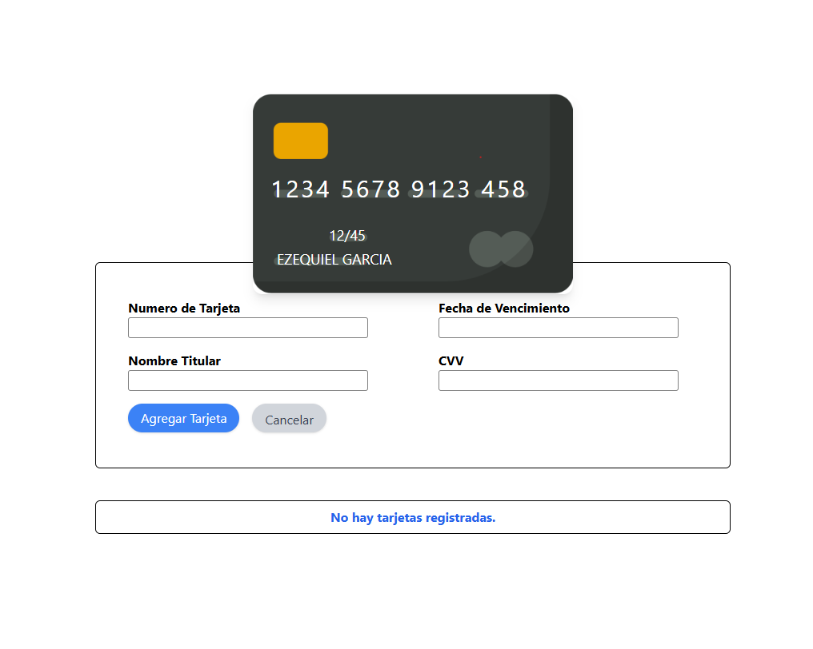
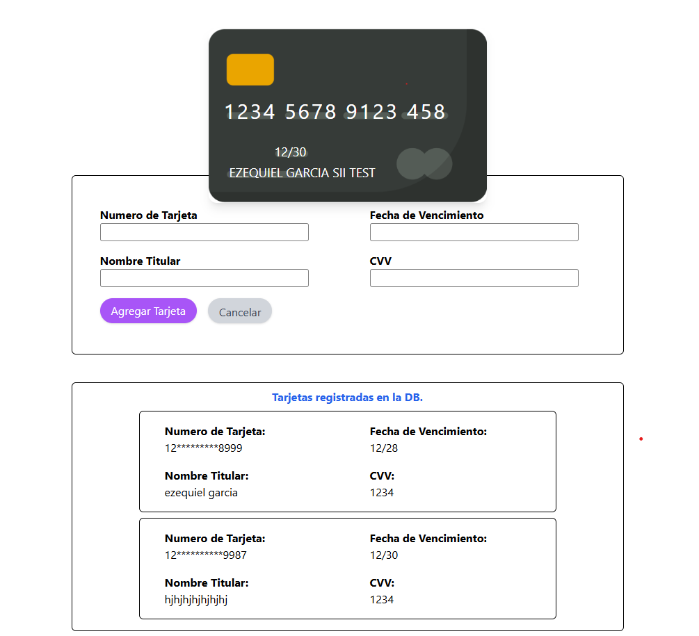

# Proyecto Front-End - Caze

## Descripción

Este proyecto es la interfaz web para hacer guardado de una tarjeta con algunas validaciones implementadas como criterio de una prueba tecnica FRONT-END.

Está hecho con **React + TypeScript**, organizado con **NX**, y con **Tailwind CSS** para estilos modernos.

Usamos:

- **Formik** para manejo de formularios.
- **Yup** para validación de esquemas.
- **Prettier** para mantener el código bonito y consistente.

Decidi utilizar esta libreria y tecnologias porque es la mas reciente que he usado. ha nivel laboral con una compania international llamada toolsgroup.

## Características principales

- Manejo de **formularios con validación** usando Formik.
- Listado dinámico de tarjetas de debito/credito usando un **context provider**.
- Estilos modernos y responsivos con Tailwind se (OJO) necesitan mejorar.
- Posibilidad de **guardar, mostrar tarjetas** por el momento en el front-end backend tiene el CRUD completo.

---

## Preview de la WEB APP

;



## Instalación

```bash
git clone https://github.com/ezequielgm25/card-saver-front-end.git
cd card-saver-front-end
npm install
```

## Run tasks

To run the dev server for your app, use:

```sh
npx nx serve card-saver
```

To create a production bundle:

```sh
npx nx build card-saver
```

## Visualizar app

Para visualizar la app una vez corriendo dirigirse al http://localhost:4200/

Alli podra agregar una tarjeta una vez el Backend se encuentre corriendo las instrucciones del mismo estan en el readme del repositorio de backend.
Back-End: https://github.com/ezequielgm25/card-saver-back-end.

Si el backend esta corriendo y funcionando puede agregar una tarjeta y la misma se agregara a una lista edbajo si cumple con los requisitos estipulados en la prueba tecnica.

Los cuales son los siguientes:

1. Realizar maquetación del diseño suministrado y tomar en cuenta:
   a) Todos los campos son requeridos.
   b) El editar los campos de tarjetas, fecha y nombre modifica el diseño de la tarjeta.
   c) El campo tarjeta solo puede contener números y un máximo de 16 caracteres.
   d) El campo fecha de vencimiento debe tener formato mm/yy.
   e) El campo fecha solo puede aceptar valores válidos para mes (01 a 12) y año (22
   hasta año actual + 5).
   f) El campo Nombre titular solo puede contener letras y letras con tildes y máximo
   de 20 caracteres.
   g) En caso de que algún campo no sea válido se debe colocar texto en rojo debajo
   del campo indicando la causa de la invalidez.

2. Al pulsar botón de Agregar tarjeta.
   a) Debe agregar la tarjeta a un bloque en el cual se mostrarán los campos de
   tarjeta, nombre y fecha vencimiento.
   b) Para cada registro se debe contener un identificador único.
   c) Debe validar que el formulario sea válido y que al no ser válido despliegue los
   textos en cada campo que no es válido.
   d) El campo de número de tarjeta se debe mostrar enmascarado, solo mostrar los
   12 primeros y 4 últimos dígitos (ej. 41**\*\*\*\***1234).

3) Al pulsar botón Cancelar se deben limpiar todos los campos.

## estructura de carpetacion

src/
├─ components/ # Componentes utilizados en la applicacion
├─ assets/ # Recursos visuales.
├─ shared/ # Aqui estan los recursos compartido en este caso Contextos de React (ej: CardContext)
├─ services/ # Funciones de API
├─ types/ # Types de uso general
└─ App.tsx

## Detalles de logica utilizada

El front-end está dividido en varios componentes para separar la lógica de negocio de la presentación, haciendo que el código sea más fácil de mantener y entender.

PageContainer
Componente principal que agrupa todos los demás. Actúa como contenedor de la página, manteniendo la estructura general.

CardLayout
Aquí se encuentra el diseño de la tarjeta de crédito. Los datos como nombre del titular y fecha de expiración se actualizan dinámicamente según lo que el usuario ingresa en el formulario.

Form
Este componente se encarga de la lógica del formulario, incluyendo validaciones con Formik y Yup. Envía la información directamente al contexto (CardContext) para que esté disponible en toda la app.

CardsList
Componente encargado de mostrar las tarjetas ya almacenadas, incluyendo la última tarjeta agregada.
Muestra la lista de forma dinámica, permitiendo que los nuevos datos se vean inmediatamente después de ser guardados.

## Enlaces de repositorios

Front-End: https://github.com/ezequielgm25/card-saver-front-end
Back-End: https://github.com/ezequielgm25/card-saver-back-end
